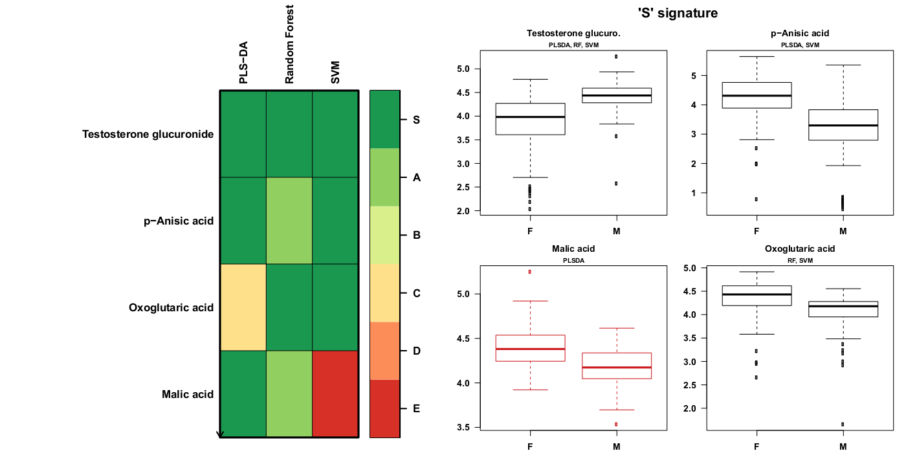

<!-- Guidance: see https://github.com/phnmnl/phenomenal-h2020/wiki/The-Guideline-for-Container-GitHub-Respository-README.md-Creation -->


# W4M Biosigner
Version: 2.2.7

## Short description

<!-- 
This should only be 20 to 40 words, hopefully a single sentence.
-->

Discovery of significant signatures from omics data.

## Description

High-throughput technologies such as transcriptomics, proteomics, and metabolomics show great promise for the discovery of biomarkers for diagnosis and prognosis. Selection of the most promising candidates between the initial untargeted step and the subsequent validation phases is critical within the pipeline leading to clinical tests. Several statistical and data mining methods have been described for feature selection: in particular, wrapper approaches iteratively assess the performance of the classifier on distinct subsets of variables. Current wrappers, however, do not estimate the significance of the selected features. We therefore developed a new methodology to find the smallest feature subset which significantly contributes to the model performance, by using a combination of resampling, ranking of variable importance, significance assessment by permutation of the feature values in the test subsets, and half-interval search. We wrapped our biosigner algorithm around three reference binary classifiers (Partial Least Squares-Discriminant Analysis, Random Forest, and Support Vector Machines) which have been shown to achieve specific performances depending on the structure of the dataset. By using three real biological and clinical metabolomics and transcriptomics datasets (containing up to 7000 features), complementary signatures were obtained in a few minutes, generally providing higher prediction accuracies than the initial full model. Comparison with alternative feature selection approaches further indicated that our method provides signatures of restricted size and high stability. Finally, by using our methodology to seek metabolites discriminating type 1 from type 2 diabetic patients, several features were selected, including a fragment from the taurochenodeoxycholic bile acid. Our methodology, implemented in the biosigner R/Bioconductor package and Galaxy/Workflow4metabolomics module, should be of interest for both experimenters and statisticians to identify robust molecular signatures from large omics datasets in the process of developing new diagnostics.

## Key features

- Feature selection
- PLS-DA
- Random Forest
- SVM

## Functionality

- Statistical Analysis

## Approaches

- Metabolomics / Targeted
- Metabolomics / Untargeted

## Metabolomics Technologies

- LC-MS
- GC-MS
- NMR

## Data Analysis

- Classification
- Feature selection
- Multivariate statistics

## Screenshots



## Tool Authors

- [Étienne Thévenot](http://etiennethevenot.pagesperso-orange.fr) (CEA, LIST, MetaboHUB).

## Container Contributors

- Pierrick Roger (CEA).

## Website

- http://workflow4metabolomics.org

## Git Repository

- https://github.com/phnmnl/container-biosigner.git

## Installation 

For local individual installation:

```bash
docker pull docker-registry.phenomenal-h2020.eu/phnmnl/biosigner
```

## Usage Instructions

For direct docker usage:

```bash
docker run docker-registry.phenomenal-h2020.eu/phnmnl/biosigner ...
```

## Publications

<!-- Guidance:
Use AMA style publications as a list (you can export AMA from PubMed, on the Formats: Citation link when looking at the entry).
-->

- Rinaudo P, Boudah S, Junot C, Thévenot EA. biosigner: A New Method for the Discovery of Significant Molecular Signatures from Omics Data. Front Mol Biosci. 2016;3:26.
